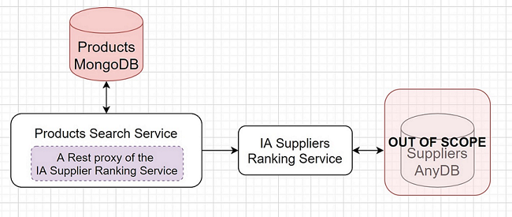
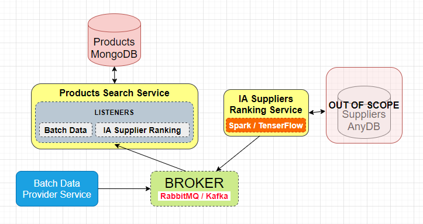
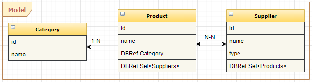
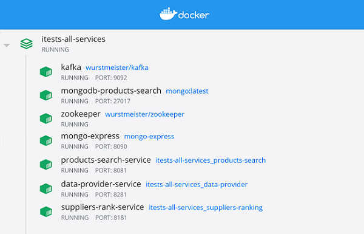

  
<h1 align="center">    
  <br>    
    RELAYR Compare Products Task    
  <br>    
</h1>    
    
<h4 align="center">Solution for the </h4>   [RELAYR Task](readme-resources/RELAYR-Task.pdf) ( <- problem description link )    
      
<p align="center">    
    <a alt="Java">    
            
    </a>    
    <a alt="Gradle">    
            
    </a>    
    <a alt="Spring Boot">    
            
    </a>    
    <a alt="MongoDB">    
            
    </a>    
    <a alt="Kafka">    
              
    </a>          
    <a alt="Docker">    
            
    </a>    
    <a alt="JavaRx">    
            
    </a>
    <a alt="MapStruct">    
            
    </a>
    <a alt="Junit5">    
            
    </a>
    <a alt="RestAssured">    
            
    </a>
    <a alt="Mockito">    
            
    </a>   
    <a alt="AssertJ">    
             
    </a>    
    <a alt="License">    
            
    </a>    
</p>    
    
## Table of Contents 
1. [Architecture](#Architecture)
   - [Intuitive approach](#First-approach)    
   - [Chosen approach](#Chosen-approach)    
2. [Model](#Model)
2. [Project sutructure](#Project-structure)
3. [Data Sources](#Data-Sources)       
4. [Build](#Build)  
5. [Run in Docker](#Run-in-Docker)  
6. [Rest API](#Rest-API)    
7. [Tests](#Tests)        
8. [Paths to improvements](#Paths-to-improvements)       
  
  
## Architecture ## 
- ## Intuitive approach ##    
    

- We could consider 2 main micro-services :  
	- **Products Search Service** : aim to respond for the search products requests based on the parameters (name, and categroy name)  
	- **Suppliers Ranking Service** : aim to respond with the suppliers ranks for each products search request
	
The implementation of the **Products Search Service** will probably use a **Declarative Rest Client** (like [Feign](https://github.com/OpenFeign/feign)) to proxify the **IA Suppliers Ranking Service**  

This leads to :  
    1_ **A tight coupling** to the **IA service** (Any trouble on it will block the **Products Search Service** )  
    2_ **Performance issue**: suppose we need to show the first **K** products with the bests ranks, and the result of the search service is very large.

- So given that we don't know how to sort the products before calling the **IA service**, we will need to :  
&nbsp;&nbsp;&nbsp;&nbsp;&nbsp;&nbsp;- Load all the products of the search result             
&nbsp;&nbsp;&nbsp;&nbsp;&nbsp;&nbsp;- Collect the products suppliers  
&nbsp;&nbsp;&nbsp;&nbsp;&nbsp;&nbsp;- Request the ranks for all the suppliers from the **IA Rest Service**  
&nbsp;&nbsp;&nbsp;&nbsp;&nbsp;&nbsp;- Update the products suppliers ranks  
&nbsp;&nbsp;&nbsp;&nbsp;&nbsp;&nbsp;- Sort the products according to their suppliers ranks  
&nbsp;&nbsp;&nbsp;&nbsp;&nbsp;&nbsp;- Return the first **K** bests products
- ## Chosen approach ##  
    
  
     We introduce a **Message Broker** like **Kafka** or **RabbitMQ**.
       
     We consider 3 micro-services :  
        - **Products Search Service**: respond for the search products requests based on the parameters (name, and category name)  
        - **Suppliers Ranking Service**: each time a new rank of the **Supplier** is calculated, a message is pushed to the **Broker**  
        - **Batch Data Provider**: send a batch of **Products** through the **Broker**, added to demonstrate the works of the **streamed** and **buffered** implemented **DataSource**
        
     Now we can take advantage of :
     - The optimization of the chosen Database (**Mongo**) to sort the result and load only the first N records
     - The loosely coupling between all the services.
## Model ##    
We consider 3 documents :

               
## Project structure ##  
The project is configured as a Gradle multi-modules (sub-projects) :  
- **lib-base-test** : contains base **Class** for the integration tests  
- **lib-common-consts** : shared constants  
- **lib-common-dtos** : shared data transfer objects  
- **lib-common-kafka-starter** : shared kafka configuration with auto-configuration startup  
- **service-products-search** : implementation of the **Products Search Service** 
- **service-suppliers-ranking** : implementation of the **Suppliers Ranking Service**  
- **service-data-provider** : implementation of the **Data Provider Service**  
- **itest-all-services** : contains integration tests for the whole system, with a complete scenario  

**Sub projects structure**:

    -root: 
        - src:
            - itest          -> integration tests
            - main           -> source code
            - test           -> unit tests
        docker-compose.yml   -> docker resources for the integration tests     
     
## Data Sources ##
Using **JavaRx** :  

&nbsp;&nbsp;&nbsp;&nbsp;&nbsp;&nbsp;- **ProductStreamBufferedDataSource** rely on the **Flowable** class which supports **buffering** and **back pressure**

&nbsp;&nbsp;&nbsp;&nbsp;&nbsp;&nbsp;- **ProductPushDataSource** rely also on the **Flowable** class but for a single push

- Both are loosely coupled with their respective consumer **ProductBatchConsumer** and **ProductConsumer** using **Spring Injection** which makes easy the implementation of others **DataSources**  

## Build ## 
```sh  
$ gradle build  
```
## Run in Docker ##  
1_ Create two volumes for the **MongoDb** image  
```sh 
$ docker volume create mongodata  
$ docker volume create mongodata_it  
```

2_ Bind the DNS **'kafka'** to **127.0.0.1** in the **HOSTS** file  
  
3_ Start the services with the **docker-compose**  
```sh  
$ cd itests-all-services
$ docker-compose up -d  
```
**Expected result** :

  
## Rest API ##  
**Swagger Documentation URL** for each service :
```sh  
/swagger-ui/index.html
```  
- **Service-products-search** endpoints : 
###### Search the products by **Product name** and **Category name** with pagination  
```sh  
GET /api/v1/products/?name=${product_name}&category=${category_name}&page=${page}&size=${size}
```  
###### Reset the products db
```sh 
GET /api/v1/products/reset/  
``` 
- **Service-suppliers-ranking** endpoints :
###### Send the Supplier Rank Message  
```sh  
GET /api/v1/suppliers/?id=${sup_id}&rank={new_rank}  
``` 
- **Service-data-provider** endpoints :  
###### Send Products Batch Message with an Offset between 0 to 100 as a parameter, allows to return a different batch
```sh  
GET /api/v1/data/?offset=${offset}  
```
## Tests ##
```sh  
$ gradle test itest  
```
For each service, the **integration tests** will :  
- Boot the required resources using the **docker-compose**   
- Execute the **Integration Tests** using **JUnit-Jupiter** extended with **SpringBoot**  
- Shutdown **docker-compose**  

**NB:** After manual startup of the **docker-compose**, the run of the **integration tests** is possible from the **IDE**, but with **'-x dockerComposeDown'** argument to prevent the **docker-compose** shutdown after each ends of the tests   
## Paths to improvements ##    
- More **Unit tests**
- Add some **Performance tests**
## Author ##
[Nassim MOUALEK](https://www.linkedin.com/in/nassim-moualek-8ab7231a/), Nov.2020        
